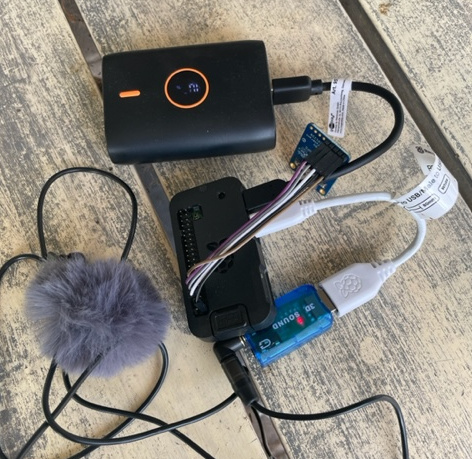
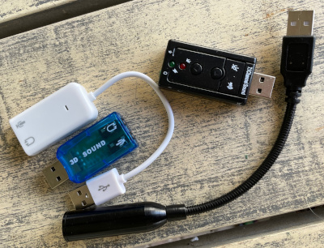
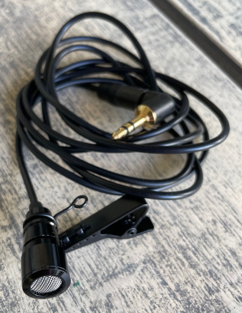
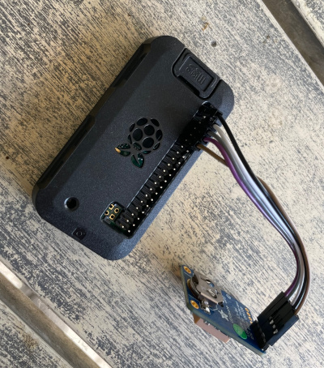
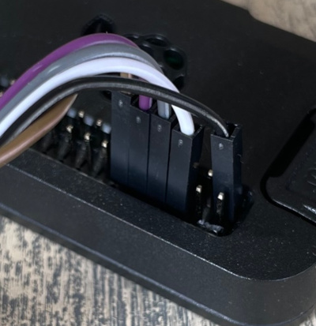

## Low cost raspberry pi sound localizing Autonomous Recording Unit 

*Or **portable gunshot locator** or **stratum 1 time server***

<p align="center">
  <p>
  
  </p>
</p>

## Introduction: ##
While initially conceived to augment security as part of the security software suite "StalkedByTheState", this project serves multiple purposes. It's morphed into an **Autonomous Recording Unit (ARU)**, a term prominently used in bioacoustics. What sets this ARU apart is its ability to precisely synchronize the time of arrival for audio packets whilst installed on inexpensive Raspberry Pi hardware. Coupled with a tracking file, this enables very accurate **Time Difference of Arrival (TDOA) sound localization**.

<br style="clear:both;">

**Key Features:**

1. **Sub-microsecond system time via GPS Integration:** The project is optimized to run on a raspberry pi together with a GPS and aligns the system time typically to sub-microsecond accuracy.The typical alignment error margin from the waveforms from the sound files is under 1ms. Given that sound covers approximately 34cm in 1ms, this ensures high effective sound localization, even over short distances.
   
2. **Resilient SD card architecture:** By default the system is installed so that it can run with a read-only mounted root file system. This provides resilience against SD card corruption due to unplanned power cycles or other reasons. Traditionally, raspberry pi's running off SD cards are frequently subjected to card corruption which mostly results in an un-bootable card. With the file system mounted as read-only, this problem is largely mitigated.

It does this by mounting what is called an overlay file system constructed in memory on top of the root file system. This allows the root file system to effectively be written to log files and other small updates. The writes are only written to the memory. Reads come from either the RO mounted rootfs unless that location was previously written to, in which case it comes from out of the memory.

**Potential Use Cases:**
- **Bioacoustic Studies:** This technology can be instrumental for researchers aiming to localize various species based on their vocalizations or other sound signatures.
- **Gunshot localizing:** Find the co-ordinates from where a gunshot comes from, this is a very useful thing to do in countering illegal poaching.
- **Stratum 1 time server:** Synchronize all of your computers and securities cameras at home with this system. For this use case you only need a GPS, no mic or USB sound card. A neo 6m GPS can be acquired for around 7 euros.
- **Sound recording for security:** Recording sounds adds an additional forensic layer to security systems. Additionally, you can then add a sound track to a recording of a camera that doesn't contain an integrated microphone.

## Installation ##

**Choice of OS**

The install script supports both the older Raspberry Pi Bullseye releases and the newer Debian Bookworm release, ready for the Raspberry Pi 5. You should choose the "Lite" versions of the OS.

One thing I noticed on the Raspberry Pi 4 with Bookworm was that after the first installation, it might not work as expected. You can check this by running gpsmon. If it's not receiving data and not fully rendering the screen, this issue might be present. If you observe this, the solution is to shut down the computer with "sudo shutdown -h now" and then unplug the power adapter from the Pi to ensure all power is cut off. There might be a serial line initialization problem with Bookworm. This procedure should resolve it. All subsequent boot-ups should be fine.

Setting up fixed network address on Bookworm is different than before and because you will install a lite version it's handy to know how to configure IP addresses if you don't want to stay with DHCP. Fixed addresses can be obtained as in the following template example:

```
# View the current settings
nmcli connection show "Wired connection 1"
# Change to a fix IP address
nmcli connection modify "Wired connection 1" ipv4.method manual ipv4.addresses 192.168.1.225/24 ipv4.gateway 192.168.1.254 ipv4.dns 192.168.1.254
```
If you used wifi, the you could show your current connection name with
```
nmcli connection show --active
```

**First**

Configure the following local settings
- Interface Options/SSH
- Localisation Options/Locale
- Localisation Options/Timezone
- Localisation Options/Keyboard
- Localisation Options/WLAN Country
- System Options/Wireless LAN (If using wifi, here you set the username and password)

```
sudo raspi-config
```
**Then**

Run the main install script

You will be prompted first to answer whether your GPS is an adafruit type (MTK3339 chipset) or a ublox/other type. If in doubt answer N. This is used to set an offset value for the chrony time keeper program.

Then you will be asked to provide the hostname. The hostname becomes part of the sound file's name and should be lowercase alphanumeric or '-' characters, starting with a letter.

During installation, when asked if you want to enable jackd for real-time you should answer "y".

The installation completes with just the one command. After many installation steps, the pi will reboot and complete some more installation steps. When the system is fully installed it will display a FINISHED banner in large letters. Once you see the login prompt, proceed to login.

```
sudo apt install -y git
git clone https://github.com/hcfman/sbts-aru.git
cd sbts-aru
sudo -H ./sbts_install_aru.sh
```

## Usage ##

**Processes**

When running, something like the following relevant processes will be visible once the GPS has established lock:

```
$ ps -fupi
UID        PID  PPID  C STIME TTY          TIME CMD
pi         635     1  1 Oct04 ?        00:23:23 /usr/bin/jackd -R -dalsa -r44100 -p2048 -i1 -n2 -D -Chw:1,0 -Phw:1,0 -S
pi         674     1  9 Oct04 ?        02:05:39 /home/pi/sbts-bin/sbts-aru -n audio_sbts1 -c audio_sbts1 -s system:capture_1 -p input -t 10 -b 44100
```
The **-p2048** flag sets the buffer size and the value (2048) is used later as the last parameter in the **gps_event_time.py** command.

**jackd** is the real-time audio distribution daemon and is reading from the USB sound card.

**sbts-aru** is the sound recorder program. If you kill this process with HUP it will close the current files it is writing and create new ones meaning you can then view the last file it closed. You cannot play a file that wasn't closed. The **-n** parameter to sbts-aru is the name. In principle you could record from different sound cards on the same machine. Both the **-n** and **-c** parameters typically have the same value and it's currently set to the same name as the hostname replacing **'-'** characters with **'_'** characters.

These processes are started up by the installed /etc/rc.local script.

**Directory structure**
The structure resembles the following:

```
sbts-bin/
sbts-aru
config
disk/log
disk/audio-sbts1/2023/2023-10/2023-10-01/2023-10-01_22-16-35.343575--audio_sbts1--2023-10-01_22-26-35.361536.tracking
disk/audio-sbts1/2023/2023-10/2023-10-01/2023-10-01_22-36-35.379332--audio_sbts1--2023-10-01_22-46-35.397175.tracking
```

**sbts-bin** is where the programs go.

**sbts-aru** is the software you cloned

**config** is a separate partition and is currently not used. But is intended for potential configuration changes so that the partition can be mounted **R/O** most of the time and re-mounted to **R/W** only when it's required to make changes.

**disk** is a separate partition and is writeable when the OS partition is mounted R/O with the in-memory file system overlay. This is where the data is written and is repaired automatically during boot if any damage happens.

**Commands**

To find the date and time from an event use gps_event_time.py as in the following example:

```
$ gps_event_time.py 2023-10-01_22-36-35.379332--audio_sbts1--2023-10-01_22-46-35.397175.tracking 283.6789 2048
2023-10-01_22-41-19.065072
```

In the example above we want to know the event time that happened 283.6789 seconds into the sound file that accompanies the tracking file supplied. Both the .flac file and the .tracking file should be in the same directory. **283.6789** in this case is the time from the start of the file, typically you get this by using a program like [raven lite](https://ravensoundsoftware.com/software/raven-lite/). 2048, as mentioned above, is the sample rate that jackd uses.

The output is the date and time format that is used by the localize_event.py program.

**Localizing**

Localization utilizes the [OpenSoundScape](http://opensoundscape.org/en/latest/) library.

Localizing is done by running localize_event.py with as input successive lines of a format containing the GPS co-ordinates of the event and the date-time of the event as in the following example:

```
$ localize_event.py 
Enter GPS coordinates and timestamps. Press enter twice to finish.
51.01415,5.813725 2023-09-17_15-49-48.523601
51.015365,5.81165 2023-09-17_15-49-48.822030
51.016368332,5.814084879 2023-09-17_15-49-48.715324
51.015221667,5.815915 2023-09-17_15-49-48.545999
```

Which results in the following output:

```
Location: 51.014906583842645,5.814450640699929

Web links:

OpenStreetMap: https://www.openstreetmap.org/?mlat=51.014906583842645&mlon=5.814450640699929#map=15/51.014906583842645/5.814450640699929

Google Maps: https://www.google.com/maps?q=51.014906583842645,5.814450640699929&t=h&z=15
```
**Docker**

You can build a docker image that runs localize_event.py as follows:

```
docker build -t localize_event .
```

Then you can run a localization as follows:

```
$ docker run -i localize_event
Enter GPS coordinates and timestamps. Press enter twice to finish.
51.01415,5.813725 2023-09-17_15-49-48.523601
51.015365,5.81165 2023-09-17_15-49-48.822030
51.016368332,5.814084879 2023-09-17_15-49-48.715324
51.015221667,5.815915 2023-09-17_15-49-48.545999

Location: 51.014906583842645,5.814450640699929

Web links:

OpenStreetMap: https://www.openstreetmap.org/?mlat=51.014906583842645&mlon=5.814450640699929#map=15/51.014906583842645/5.814450640699929

Google Maps: https://www.google.com/maps?q=51.014906583842645,5.814450640699929&t=h&z=15
```

Or use the pre-built docker image for 64-bit x86 platforms.

Found on [https://hub.docker.com/r/kimhdocker/sbts-aru](https://hub.docker.com/r/kimhdocker/sbts-aru)

```
docker pull kimhdocker/sbts-aru:1.0.0
docker run -i localize_event
```
## Hardware requirements ##

**Any Raspberry Pi**

The raspberry pi zero series have the lowest power usage for portable usage. Raspberry Pi Zero W is typically less than 20 euros.

**GPS capable of providing data read/write and PPS signals**

These include, but are not limited to **ublox neo 6m, 7m and 8m**, as well as **Adafruit ultimate breakout boards**. The ublox modules can be obtained from aliexpress for around 7 euros. My choice would be the neo 7m.

**16-bit USB sound card**

Compliant with jackd. Typically all the **cirrus logic cm108** based ones work as well as the **General Plus** based ones. These can be as cheap as less than one euro. My preference is the General Plus based ones as they tend to be able to provide higher mic boost gain.

Below is a picture that contains various compatible sound cards and one low cost USB microphone (That includes a cm108 based sound card).

<p align="center">
  <p>
  
  </p>
</p>

**Microphone**

A microphone capable of running with the above USB sound cards. These would be 2-wire ones that take their power from the USB Sound Cards.

My personal preference is quite expensive but exceptional, it is the **primo em272 based microphone capsules** available from [micbooster](https://micbooster.com/microphone-capsules/199-primo-em272.html). These are also available as made up "clippy" units and also from [veldshop.nl](https://www.veldshop.nl/en/).

I like them because they have low self noise, high gain and high S/N ratio. They are also spoken favourably about by nature recorders, which to me speaks of their quality.

Below is a picture of an "clippy" EM272 microphone.

<p align="center">
  <p>
  
  </p>
</p>

However, for sound location purposes you might be able to get away with cheap all-in-one USB microphones, which I purchased in the past for less than 10 euros.

I've also tested it with one model (Not the most recent) of Petterson Ultrasonic USB microphones at 384khz and it also worked fine.

**Dead Cat wind noise reducer**

Optional but very important for outdoor usage is some sort of wind noise reducing system. I found some fluffy "dead cat" like ones for 1 euro each on aliexpress.

**Raspberry Pi Adapter Pack**

For use with a battery power pack you may found it necessary to buy a Raspberry Pi Adapter Pack in order to get a connector for the USB Sound Card and/or the power pack (The Power Pack should typically contain one such cable).

## Physical Wiring ##

For the following sections it may be useful to look at the GPIO pinout diagram [GPIO pinout](https://learn.sparkfun.com/tutorials/raspberry-gpio/gpio-pinout).

**Common requirements**

- **+V** should be wired to **3.3V**, I use pin 1.
- **-V** should be wired to **ground**, I use pin 6.
- **RX** on the **GPS** should be wired to **TX(D0)**, **pin 8**.
- **TX** on the **GPS** should be wired to **RX(D0)**, **pin 10**.
- **PPS** on the **GPS** should be wired to **GPIO 18**, **pin 12**.

With all of the GPS's I tend to leave all the wires in-line at the GPS side and make changes at the Pi side.

**Be very careful not to plug the PPS line into ground or you will blow the GPS up:** I've done this as GPIO 18 is right next to a ground line.

The Neo series GPS's from aliexpress are considerably cheaper than the Adafruit ones. The Adafruit ones have an easier to understand output with the gpsmon command. I did buy about 5x of the Adafruit GPS's but now I would buy the Neo 7m ones. Sometimes it's nice to support companies that support the hobbist market though.

**Adafruit Ultimate breakout**

With the Adafruit series, the **PPS** line at the Pi side should be bend so as to be next to the **TX** line. Connect the power wire to pin 1. Then all the lines can then be plugged in a line after skipping the first 2 pins.

<p align="center">
  <p>
  
  </p>
  <p>
  
  </p>
</p>

**Neo 6m and 7m**

The Neo 6m and 7m have the simplest wiring as all the wires remain in a line. The power wire is connected to pin 1, then the next 4 wires connect to the Pin all in a line after skipping the first to pins. i.e. starting from pin 6.

For all of the Neo series GPS's the PPS wiring, such as the brown wire in the photo above with the Adafruit GPS is not dragged to the back as in the Adafruit example but rather the wire is in-line with the data lines.

**Neo 8m**

The Neo 8m is slightly different, the TX and TX lines are reversed on the GPS, that means you have to reverse them at the Pi end as well. So the wiring is just like for the Neo 6m and 7m except the middle 2 wires of the group of 4 are reversed.

Very very anecdotely, I felt that the Neo 8m seemed to be less sensitive than the Neo 6m and 7m's. In other words, on two occasions I had to add an additional GPS antenna in cases where this wasn't necessary on the Neo 6m and 7m. Don't know why I experienced that. I would have thought it was more sensitive. Having said this, I didn't test this very scientifically.

For all of the Neo series GPS's the PPS wiring, such as the brown wire in the photo above with the Adafruit GPS is not dragged to the back as in the Adafruit example but rather the wire is in-line with the data lines.

## Tuning the system time daemon chrony ##

The install software installs the chrony daemon for time keeping. In the past the ntp daemon was most commonly used for this. The install software attempts to configure the systems so they should come up running successfully, synched to the GPS. It does this by first asking the question as to which GPS type you have, the Adafruit series need to have a larger value for the NMEA source offset configured in /etc/chrony/chrony.conf than the ublox series. I haven't used any other type.

When the GPS has obtained a position and satellite lock then the chrony daemon can use it as a viable source. If it's the considered the best choice source then PPS will appear as a source with an asterisk beside it in the output of running the chronyc sources command as in the following:

```
$ chronyc sources
MS Name/IP address         Stratum Poll Reach LastRx Last sample               
===============================================================================
#? NMEA                          0   2   377     4   +128ms[ +128ms] +/-  169ms
#* PPS                           0   2   377     4   +118ns[ -120ns] +/- 2555ns
```

The above diagram shows that the PPS source is both the source of choice (#* at the start) and has an offset of 120ns from the actual time currently.

It also shows a value of "4" in the LastRx field. It's important that this field has a number in it that goes up but then down again. If it just justs increasingly higher then the GPS daemon is not being used by the PPS time source correctly.

Additional information can be had with the chronyc sourcestats command as follows:

```
$ chronyc sourcestats
Name/IP Address            NP  NR  Span  Frequency  Freq Skew  Offset  Std Dev
==============================================================================
NMEA                       26  15   102   +149.294     66.756   +130ms  2599us
PPS                         6   3    20     +0.011      0.193    +35ns   447ns
```

In the above output we see that the PPS source has an offset of 35ns from the real time and the NMEA source has an un-mitigated offset of 130ms. This later value has to be less than 200ms or the GPS will not be used for for the PPS source. Watch this value over time and you can lower it by increasing the offset value in /etc/chrony/chrony.conf. For example, in this case if the offset remains consistently around 130ms, I might choose to add around 120ms to the offset value in /etc/chrony/chrony.conf.

In the example above the /etc/chrony/chrony.conf files the following values towards the end:

```
refclock SHM 0 delay 0.325 offset 0.330 poll 2 refid NMEA noselect
refclock PPS /dev/pps0 lock NMEA poll 2 refid PPS prefer
```

I could probably safely add 90ms in any case to the offset value, increasing it from 0.330 to 0.420 to improve the convergence.

It appears however, that this offset value changes over time, maybe with temperature. So long as the value is showing up less than 200ms (I think on later software versions 400ms) then the system will adjust the offset correctly and the GPS will be used together with PPS as a source. Make sure that you observe this value over an extended period of time before making improvement changes. Usually 0.100 is a safe value for the most GPS's. If the LastRx field in chronyc sources doesn't have a value or monotonically increases, then the offset value here can be a cause.

Another useful command is the following:

```
$ chronyc tracking
Reference ID    : 50505300 (PPS)
Stratum         : 1
Ref time (UTC)  : Sat Oct 07 11:43:18 2023
System time     : 0.000000063 seconds fast of NTP time
Last offset     : +0.000000063 seconds
RMS offset      : 0.000000232 seconds
Frequency       : 5.111 ppm fast
Residual freq   : +0.000 ppm
Skew            : 0.014 ppm
Root delay      : 0.000000001 seconds
Root dispersion : 0.000004053 seconds
Update interval : 4.0 seconds
Leap status     : Normal
```

The above is showing that the system time is **"0.000000063 seconds fast of NTP time"**, which means that the system time error is currently 63ns away from the real true time. Well under 1 microsecond. That's pretty accurate!!

PPS stands for Pulse Per Second and is the line that is connected to GPIO 18. This line and interrupt is what synchronizes the slow data transmitted over the serial line with the actual point in time for which it is applied.

## About the in-memory Overlay File system ##
I've glossed over this in the above to avoid distractions. When the sbts-aru first boots, it operates in a regular read-write (R/W) mode. However, after the first reboot, the root file system is mounted as read-only (R/O), with an in-memory Overlay File System mounted on top.

This configuration ensures the root file system effectively appears and operates as R/W, but all write operations only occur in memory. The actual root file system, which contains the software, remains R/O, safeguarding it against corruption from unplanned power cycles or other disruptions.

However, this also implies that you shouldn't attempt to install software or write anywhere other than the ~pi/disk partition, as you'd be using and consuming memory.

If you wish to make permanent changes to the rootfs, such as installing software or modifying configurations in /etc/rc, crontab, etc., you should first reboot into the R/W configuration as follows:

**Re-booting to a R/W configuration**

```
sudo ~pi/sbts-bin/make_readwrite.sh
reboot
```

and when you have finished making changes you should re-boot to the resilient/production R/O mode of operation as follows:

**Re-booting to R/O configuration**

```
sudo ~pi/sbts-bin/make_readonly.sh
reboot
```
You can identify whether you are in this R/O mode of operation as follows and observing the line starting with "/". It should mention **overlay**.

**Identifying R/O mode of operation**

```
$ findmnt
TARGET                                SOURCE         FSTYPE     OPTIONS
/                                     overlayfs-root overlay    rw,relatime,lowerdir=/mnt/lower,upperdir=/mnt/rw/upper,workdir=
```

The R/W mode of operation should mention **/dev/mmcblk0p2**. In this mode is okay to install software onto the Pi.

**Identifying R/W mode of operation**

```
$ findmnt
TARGET                           SOURCE         FSTYPE     OPTIONS
/                                /dev/mmcblk0p2 ext4       rw,noatime
```
