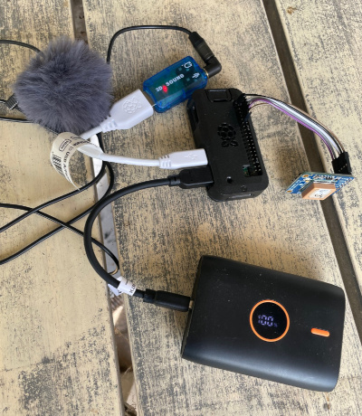

## StalkedByTheState: Low cost Autonomous Recording Unit 

*Or portable gunshot locator or stratum 1 time server*

<p align="center">
  <p>
  
  </p>
</p>

## Introduction: ##
While initially conceived to augment security, this project serves multiple purposes. It's morphed into an **Autonomous Recording Unit (ARU)**, a term prominently used in bioacoustics. What sets this ARU apart is its ability to precisely synchronize the time of arrival for audio packets whilst installed on inexpensive Raspberry Pi hardware. Coupled with a tracking file, this enables very accurate **Time Difference of Arrival (TDOA) sound localization**.

<br style="clear:both;">

**Key Features:**

1. **Sub-microsecond system time via GPS Integration:** The project is optimized to run on a raspberry pi together with a GPS and aligns the system time typically to sub-microsecond accuracy.The typical alignment error margin from the waveforms from the sound files is under 1ms. Given that sound covers approximately 34cm in 1ms, this ensures high effective sound localization, even over short distances.
   
2. **Resilient SD card architecture:** By default the system is installed so that it can run with a read-only mounted root file system. This provides resilience against SD card corruption due to unplanned power cycles or other reasons. Traditionally, raspberry pi's running off SD cards are frequently subjected to card corruption which mostly results in an un-bootable card. With the file system mounted as read-only, this problem is largely mitigated.

It does this by mounting what is called an overlay file system constructed in memory on top of the root file system. This allows the root file system to effectively be written to log files and other small updates. The writes are only written to the memory. Reads come from either the RO mounted rootfs unless that location was previously written to, in which case it comes from out of the memory.

**Potential Use Cases:**
- **Bioacoustic Studies:** This technology can be instrumental for researchers aiming to localize various species based on their vocalizations or other sound signatures.
- **Gunshot localizing:** Find the co-ordinates from where a gunshot comes from, this is a very useful thing to do in countering illegal poaching.
- **Stratum 1 time server:** Synchronize all of your computers and securities cameras at home with this system. For this use case you only need a GPS, no mic or USB sound card. A neo 6m GPS can be acquired for around 7 euros.
- **Sound recording for security:** Recording sounds adds an additional forensic layer to security systems. Additionally, you can then add a sound track to a recording of a camera that doesn't contain an integrated microphone.

## Installation ##

**First**

Configure the following local settings
- Interface Options/SSH
- Localisation Options/Locale
- Localisation Options/Timezone
- Localisation Options/Keyboard
- Localisation Options/WLAN Country
- System Options/Wireless LAN (If using wifi, here you set the username and password)

```
sudo raspi-config
```
**Then**

Run the main install script

You will be prompted first to answer whether your GPS is an adafruit type (MTK3339 chipset) or a ublox/other type. If in doubt answer N. This is used to set an offset value for the chrony time keeper program.

Then you will be asked to provide the hostname. The hostname becomes part of the sound file's name and should be lowercase alphanumeric or '-' characters, starting with a letter.

The installation completes with just the one command. After many installation steps, the pi will reboot and complete some more installation steps. When the system is fully installed it will display a FINISHED banner in large letters. Once you see the login prompt, proceed to login.

```
git clone https://github.com/hcfman/sbts-aru.git
cd sbts-aru
sudo -H ./sbts_install_aru.sh
```

## Usage ##

**Processes**

When running, something like the following relevant processes will be visible once the GPS has established lock:

```
$ ps -fupi
UID        PID  PPID  C STIME TTY          TIME CMD
pi         635     1  1 Oct04 ?        00:23:23 /usr/bin/jackd -R -dalsa -r44100 -p2048 -i1 -n2 -D -Chw:1,0 -Phw:1,0 -S
pi         674     1  9 Oct04 ?        02:05:39 /home/pi/sbts-bin/sbts-aru -n audio_sbts1 -c audio_sbts1 -s system:capture_1 -p input -t 10 -b 44100
```
The **-p2048** flag sets the buffer size and the value (2048) is used later as the last parameter in the **gps_event_time.py** command.

**jackd** is the real-time audio distribution daemon and is reading from the USB sound card.

**sbts-aru** is the sound recorder program. If you kill this process with HUP it will close the current files it is writing and create new ones meaning you can then view the last file it closed. You cannot play a file that wasn't closed. The **-n** parameter to sbts-aru is the name. In principle you could record from different sound cards on the same machine. Both the **-n** and **-c** parameters typically have the same value and it's currently set to the same name as the hostname replacing **'-'** characters with **'_'** characters.

These processes are started up by the installed /etc/rc.local script.

**Directory structure**
The structure resembles the following:

```
sbts-bin/
sbts-aru
config
disk/log
disk/audio-sbts1/2023/2023-10/2023-10-01/2023-10-01_22-16-35.343575--audio_sbts1--2023-10-01_22-26-35.361536.tracking
disk/audio-sbts1/2023/2023-10/2023-10-01/2023-10-01_22-36-35.379332--audio_sbts1--2023-10-01_22-46-35.397175.tracking
```

**sbts-bin** is where the programs go.

**sbts-aru** is the software you cloned

**config** is a separate partition and is currently not used. But is intended for potential configuration changes so that the partition can be mounted **R/O** most of the time and re-mounted to **R/W** only when it's required to make changes.

**disk** is a separate partition and is writeable when the OS partition is mounted R/O with the in-memory file system overlay. This is where the data is written and is repaired automatically during boot if any damage happens.

**Commands**

To find the date and time from an event use gps_event_time.py as in the following example:

```
$ gps_event_time.py 2023-10-01_22-36-35.379332--audio_sbts1--2023-10-01_22-46-35.397175.tracking 283.6789 2048
2023-10-01_22-41-19.065072
```

In the example above we want to know the event time that happened 283.6789 seconds into the sound file that accompanies the tracking file supplied. Both the .flac file and the .tracking file should be in the same directory. **283.6789** in this case is the time from the start of the file, typically you get this by using a program like [raven lite](https://ravensoundsoftware.com/software/raven-lite/). 2048, as mentioned above, is the sample rate that jackd uses.

The output is the date and time format that is used by the localize_event.py program.

**Localizing**

Localization utilizes the [OpenSoundScape](http://opensoundscape.org/en/latest/) library.

Localizing is done by running localize_event.py with as input successive lines of a format containing the GPS co-ordinates of the event and the date-time of the event as follows:

```
$ localize_event.py 
Enter GPS coordinates and timestamps. Press enter twice to finish.
51.01415,5.813725 2023-09-17_15-49-48.523601
51.015365,5.81165 2023-09-17_15-49-48.822030
51.016368332,5.814084879 2023-09-17_15-49-48.715324
51.015221667,5.815915 2023-09-17_15-49-48.545999

Location: 51.014906583842645,5.814450640699929

Web links:

OpenStreetMap: https://www.openstreetmap.org/?mlat=51.014906583842645&mlon=5.814450640699929#map=15/51.014906583842645/5.814450640699929

Google Maps: https://www.google.com/maps?q=51.014906583842645,5.814450640699929&t=h&z=15
```
**Docker**

You can build a docker image that runs localize_event.py as follows:

```
sudo docker build -t localize_event .
```

Then you can run a localization as follows:

```
$ sudo docker run -i localize_event
Enter GPS coordinates and timestamps. Press enter twice to finish.
51.01415,5.813725 2023-09-17_15-49-48.523601
51.015365,5.81165 2023-09-17_15-49-48.822030
51.016368332,5.814084879 2023-09-17_15-49-48.715324
51.015221667,5.815915 2023-09-17_15-49-48.545999

Location: 51.014906583842645,5.814450640699929

Web links:

OpenStreetMap: https://www.openstreetmap.org/?mlat=51.014906583842645&mlon=5.814450640699929#map=15/51.014906583842645/5.814450640699929

Google Maps: https://www.google.com/maps?q=51.014906583842645,5.814450640699929&t=h&z=15
```

Or use the pre-built docker image for 64-bit x86 platforms.

Found on [https://hub.docker.com/r/kimhdocker/sbts-aru](https://hub.docker.com/r/kimhdocker/sbts-aru)

```
docker pull kimhdocker/sbts-aru:1.0.0
docker run -i localize_event
```

